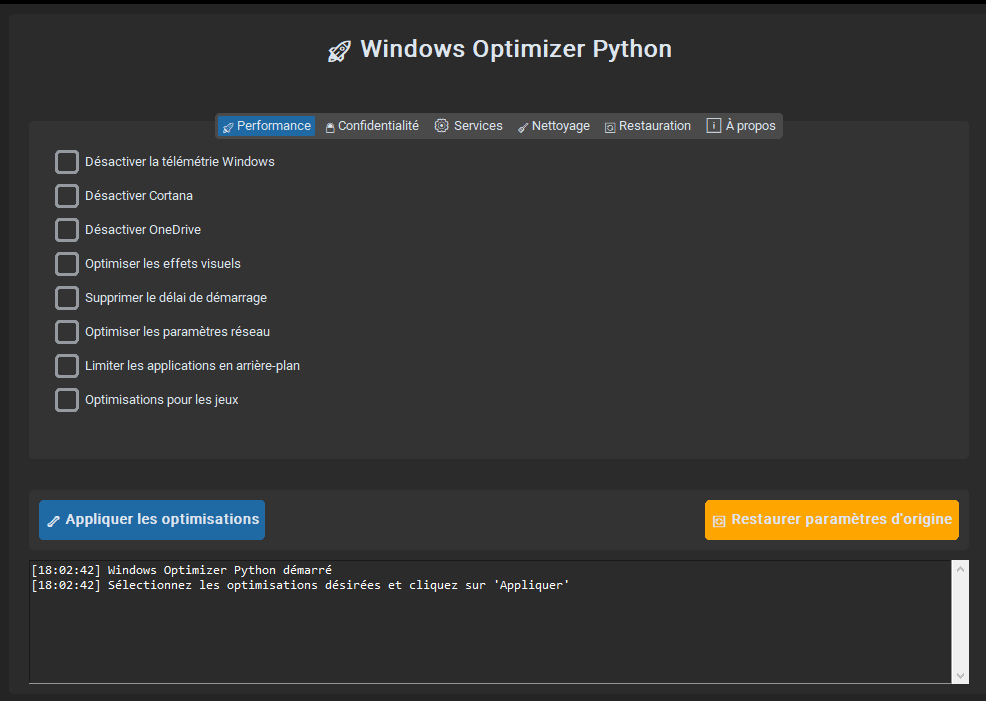
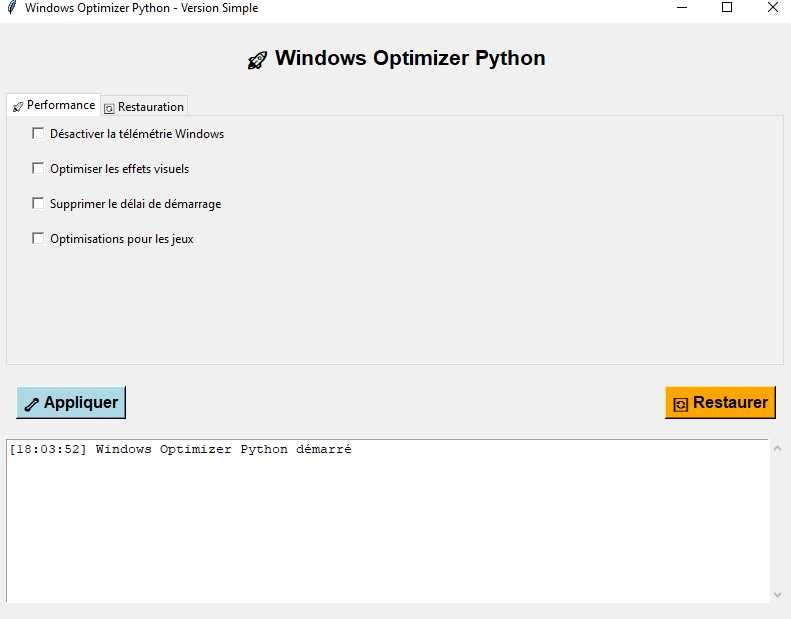

<div align="center">

# 🚀 Windows Optimizer Python


[](https://www.microsoft.com/windows)
[](https://www.python.org/)
[](https://github.com/yourusername/windows-optimizer-python/releases)
[](LICENSE)

### 🛡️ L'Optimiseur Windows Nouvelle Génération
Optimisation système avancée avec restauration intelligente des paramètres

[Documentation](#-documentation) • 
[Télécharger](#-installation) • 
[Contribuer](#-contribution) • 
[Support](#-support)

---

</div>

## 🌟 Points Forts

<div align="center">
<table>
<tr>
<td align="center" width="25%">

<br><b>Performance</b>
<br>Boost système intelligent
</td>
<td align="center" width="25%">

<br><b>Sécurité</b>
<br>Protection renforcée
</td>
<td align="center" width="25%">

<br><b>Restauration</b>
<br>Retour instantané
</td>
<td align="center" width="25%">

<br><b>Contrôle Total</b>
<br>Personnalisation complète
</td>
</tr>
</table>
</div>

## ✨ Fonctionnalités

<div align="center">
<table>
<tr>
<td width="50%" align="center">

### 🚀 Performance & Gaming

- Optimisation avancée du système
- Mode Gaming avec priorité GPU
- Réduction de la latence réseau
- Boost des performances DirectX
- Optimisation mémoire et CPU
- Tweaks spéciaux pour les jeux

</td>
<td width="50%" align="center">

### 🛡️ Sécurité & Confidentialité

- Contrôle total de la télémétrie
- Protection des données personnelles
- Désactivation des trackers
- Gestion des services Windows
- Pare-feu optimisé
- Sécurité renforcée

</td>
</tr>
<tr>
<td width="50%" align="center">

### 🧹 Nettoyage & Optimisation

- Nettoyage système intelligent
- Gestion des applications UWP
- Optimisation du stockage
- Suppression fichiers inutiles
- Nettoyage du registre
- Défragmentation avancée

</td>
<td width="50%" align="center">

### 🔄 Sauvegarde & Restauration

- Restauration en 1-clic
- Sauvegarde automatique
- Historique des modifications
- Points de restauration
- Retour paramètres d'origine
- Interface intuitive

</td>
</tr>
</table>
</div>

### 🔒 Protection de la Confidentialité
- Désactivation des services de localisation
- Suppression de l'ID publicitaire
- Désactivation des demandes de commentaires
- Protection contre la collecte de données

### ⚙️ Gestion des Services
- Contrôle des services Windows
- Arrêt des services inutiles
- Configuration automatique

### 🧹 Nettoyage Système
- Suppression des fichiers temporaires
- Vidage de la corbeille
- Nettoyage du cache des navigateurs
- Suppression des journaux Windows

### 🔄 Restauration Complète
- **Sauvegarde automatique** des paramètres d'origine
- **Restauration en un clic** des paramètres Windows d'origine
- Sauvegarde manuelle
- Historique des modifications

## 💻 Interface & Utilisation

<div align="center">
<table>
<tr>
<td width="50%">

### 📈 Dashboard Principal


</td>
<td width="50%">

### ⚙️ Version Simple


</td>
</tr>
</table>
</div>

## 💾 Installation

<table>
<tr>
<td width="50%">

### 🌟 Version Simple
```bash
# Installation rapide
git clone https://github.com/username/optimizer
cd optimizer/pythonversion
./run_simple.bat
```
- Interface classique
- Aucune dépendance
- Installation instantanée

</td>
<td width="50%">

### ✨ Version Complète
```bash
# 1. Installation des dépendances
./install_dependencies.bat

# 2. Lancement
./run_optimizer.bat
```
- Interface moderne
- Fonctionnalités avancées
- Expérience complète

</td>
</tr>
</table>

## 🛠️ Installation

1. **Cloner ou télécharger** le projet
2. **Installer les dépendances** :
   ```bash
   pip install -r requirements.txt
   ```
3. **Exécuter en tant qu'administrateur** :
   ```bash
   python optimizer_python.py
   ```

## 📦 Dépendances

- `customtkinter` - Interface graphique moderne
- `psutil` - Informations système
- `pillow` - Gestion des images
- Modules Windows intégrés (`winreg`, `subprocess`)

## ⚠️ Important

- **Exécutez toujours en tant qu'administrateur** pour accéder à toutes les fonctionnalités
- **Une sauvegarde automatique** est créée avant toute modification
- **Redémarrez votre ordinateur** après avoir appliqué les optimisations
- **Testez sur une machine virtuelle** avant utilisation en production

## 🔄 Fonctionnalité de Restauration

### Sauvegarde Automatique
- Sauvegarde automatique avant toute modification
- Fichier JSON avec tous les paramètres d'origine
- Horodatage des modifications

### Restauration
- **Restauration complète** : Remet tous les paramètres Windows à leur état d'origine
- **Sauvegarde manuelle** : Créer une sauvegarde à tout moment
- **Vérification d'intégrité** : Validation des sauvegardes

## 🎯 Utilisation

1. **Lancez l'application** en tant qu'administrateur
2. **Sélectionnez les optimisations** désirées dans les différents onglets
3. **Cliquez sur "Appliquer les optimisations"**
4. **Redémarrez votre ordinateur**
5. **Pour restaurer** : Utilisez l'onglet "Restauration" et cliquez sur "Restaurer tous les paramètres"

## 🔧 Onglets Disponibles

- **🚀 Performance** : Optimisations de vitesse et réactivité
- **🔒 Confidentialité** : Protection des données personnelles
- **⚙️ Services** : Gestion des services Windows
- **🧹 Nettoyage** : Nettoyage des fichiers inutiles
- **🔄 Restauration** : Restauration des paramètres d'origine
- **ℹ️ À propos** : Informations sur l'application

## 📝 Journal des Modifications

La zone de log en bas de l'application affiche :
- Toutes les actions effectuées
- Les erreurs rencontrées
- L'horodatage des opérations
- Les confirmations de succès

## 🛡️ Sécurité

- **Sauvegarde obligatoire** avant toute modification
- **Validation des permissions** administrateur
- **Gestion d'erreurs** complète
- **Restauration garantie** des paramètres d'origine

## 🎨 Interface

- **Design moderne** avec CustomTkinter
- **Mode sombre** par défaut
- **Interface intuitive** avec onglets
- **Feedback visuel** en temps réel

## 🔗 Basé sur

Ce projet est une version Python du célèbre [Optimizer](https://github.com/hellzerg/optimizer) de hellzerg, avec des améliorations et une fonctionnalité de restauration complète.

## ⚖️ Licence

Utilisez cet outil à vos propres risques. Toujours créer une sauvegarde système avant utilisation.

---

**🚨 ATTENTION** : Cet outil modifie des paramètres système importants. Utilisez-le uniquement si vous comprenez les implications de chaque modification.

## 📖 Documentation

<div align="center">
<table>
<tr>
<td width="33%" align="center">

### 🛡️ Sécurité
- Vérification admin
- Sauvegarde auto
- Protection système
- Gestion des erreurs

</td>
<td width="33%" align="center">

### 💻 Configuration
- Windows 10/11
- Python 3.8+
- 50 Mo d'espace
- Droits admin

</td>
<td width="33%" align="center">

### 📈 Performance
- Optimisation CPU
- Boost mémoire
- Réduction latence
- Mode gaming

</td>
</tr>
</table>
</div>

## 🧱 Contribution

<div align="center">
<table>
<tr>
<td width="25%" align="center">

### 🔍 Issues
Signaler bugs et
suggestions

</td>
<td width="25%" align="center">

### 👷 Pull Request
Proposer des
améliorations

</td>
<td width="25%" align="center">

### 📖 Wiki
Contribuer à la
documentation

</td>
<td width="25%" align="center">

### 👨‍💻 Code
Améliorer les
fonctionnalités

</td>
</tr>
</table>
</div>

## 💬 Support & Communauté

<div align="center">
<table>
<tr>
<td width="25%" align="center">

### 📧 Email
support@
optimizer.com

</td>
<td width="25%" align="center">

### 💬 Discord
[Rejoindre](https://
discord.gg/optimizer)

</td>
<td width="25%" align="center">

### 🌐 Site Web
[optimizer.
com](https://optimizer.com)

</td>
<td width="25%" align="center">

### 📈 GitHub
[Issues &
Discussions](https://github.com)

</td>
</tr>
</table>
</div>

## ⚖️ Licence

<div align="center">

Ce projet est sous licence MIT. Voir le fichier [LICENSE](LICENSE) pour plus de détails.

**⚠️ Attention** : Utilisez cet outil à vos propres risques. Créez toujours une sauvegarde système avant utilisation.

---

<sub>Développé avec ❤️ par l'équipe Windows Optimizer Python</sub>

[Documentation](#-documentation) • 
[GitHub](https://github.com) • 
[Signaler un bug](https://github.com/issues) • 
[Contribuer](#-contribution)

</div>
