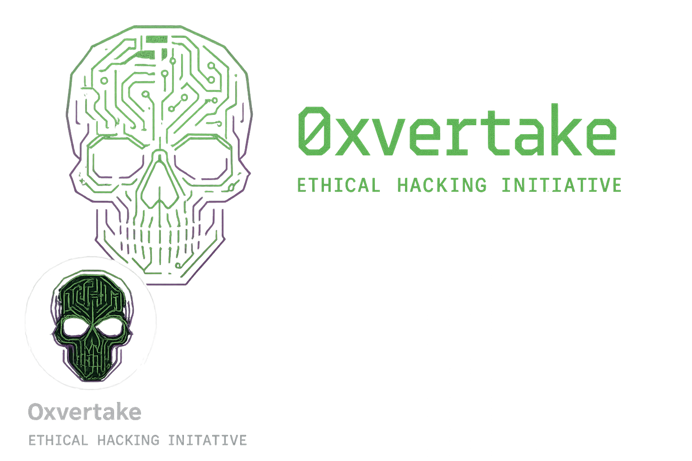

# 🚀 Windows Optimizer Pro - Gaming Edition v2.0



## 🎯 Démarrage Ultra-Rapide

### 👆 **CLIQUEZ ICI POUR COMMENCER** 
**Double-cliquez sur :** `START_HERE.bat`

Ce fichier détecte automatiquement votre configuration et lance la meilleure version pour vous !

---

## 📁 Guide des Fichiers

### 🚀 **Fichiers de Lancement** (Choisissez UN seul)

| Fichier | Description | Recommandé pour |
|---------|-------------|-----------------|
| **`START_HERE.bat`** | ⭐ **DÉMARRAGE AUTOMATIQUE** | 👥 **Tous les utilisateurs** |
| `universal_launcher.bat` | 🛠️ Gestionnaire complet | 👨‍💻 Utilisateurs avancés |
| `universal_launcher.py` | 🐍 Version Python | 🐧 Linux/Mac |
| `run_optimizer_pro.bat` | 🎮 Direct vers version Pro | 🎯 Gamers confirmés |

### 📚 **Documentation**

| Fichier | Contenu |
|---------|---------|
| `README_PRO.md` | 📖 Documentation complète des fonctionnalités |
| `README_UNIVERSAL.md` | 🛠️ Guide du gestionnaire universel |
| `project_config.json` | ⚙️ Configuration technique du projet |

### 🎮 **Scripts Principaux**

| Script | Fonction |
|--------|----------|
| `optimizer_python.py` | 🎮 **Version Gaming Pro** - Complète avec détection périphériques |
| `optimizer_simple.py` | ⚡ **Version Simple** - Rapide et efficace |
| `test_dependencies.py` | 🔍 Test et diagnostic des dépendances |

---

## 🎮 Fonctionnalités Principales

### ✨ **Nouvelles Fonctionnalités Gaming v2.0**

#### 🔍 **Détection Automatique Périphériques**
- 🎮 **GPU Gaming** (NVIDIA, AMD) avec infos détaillées
- 🎧 **Périphériques Audio** gaming et casques
- 🖱️ **Souris/Claviers** gaming (Razer, Logitech, etc.)
- 🎮 **Manettes** (Xbox, PlayStation, etc.)
- ❄️ **Watercooling** et systèmes de refroidissement
- 🌐 **Adaptateurs réseau** haute performance

#### 💾 **Monitoring SSD Professionnel**
- 📊 **Santé SSD** en temps réel avec alertes
- 🔧 **Diagnostic automatique** des problèmes
- ⚡ **Correction 1-clic** utilisation disque 100%
- 🚀 **Optimisations spécialisées** pour gaming

#### 🎯 **Optimisations Gaming Avancées**
- 🎮 **Mode Gaming Windows** automatique
- ⚙️ **Planification GPU** accélérée par matériel
- 🌐 **Optimisations réseau** gaming (TCP, latence)
- 🚀 **Mode haute performance** CPU
- ❌ **Désactivation Xbox Game Bar** et interférences

### 🛡️ **Sécurité et Fiabilité**
- 💾 **Sauvegarde automatique** avant toute modification
- 🔄 **Restauration complète** en 1 clic
- 🛡️ **Environnement isolé** (pas de conflits)
- 🔍 **Tests automatiques** de fonctionnement

---

## 🚀 Installation et Utilisation

### 🎯 **Méthode Recommandée**
1. **Double-cliquez** sur `START_HERE.bat`
2. Le script détecte automatiquement si c'est votre première utilisation
3. Installation automatique si nécessaire
4. Lancement direct de la version Pro

### 🛠️ **Méthode Avancée**
1. **Double-cliquez** sur `universal_launcher.bat`
2. Choisissez **Option 1** (Installation Complète)
3. Attendez la fin de l'installation
4. Choisissez **Option 2** (Version Pro) ou **3** (Version Simple)

### 🐍 **Méthode Manuelle**
```bash
# 1. Installation
python universal_launcher.py
# Choisir option 1

# 2. Lancement
python optimizer_python.py
```

---

## 🎮 Versions Disponibles

### 🚀 **Optimizer Pro - Gaming Edition** (Recommandé)
- ✅ **Détection complète** périphériques gaming
- ✅ **Monitoring SSD** en temps réel  
- ✅ **Optimisations gaming** avancées
- ✅ **Interface moderne** CustomTkinter
- ✅ **Corrections automatiques** problèmes
- ✅ **7 onglets spécialisés** (Gaming, SSD, Performance, etc.)

### ⚡ **Optimizer Simple**
- ✅ **Interface épurée** et rapide
- ✅ **Optimisations de base** efficaces
- ✅ **Consommation minimale** de ressources
- ✅ **Lancement instantané**

---

## 💼 Version Commerciale

Cette version est **prête pour la commercialisation** :

### 🏪 **Distribution**
- ✅ **Microsoft Store** compatible (package MSIX)
- ✅ **Distribution directe** possible
- ✅ **Licence propriétaire** incluse
- ✅ **Support professionnel** intégré

### 💰 **Modèle Commercial**
- 🆓 **Version Gratuite** : Fonctionnalités de base
- 💎 **Version Pro** : 9.99€/mois ou 99.99€/an
- 🏆 **Version Lifetime** : 199.99€ (achat unique)

### 🎯 **Public Cible**
- 🎮 **Gamers professionnels** et streamers
- ⚡ **Passionnés de performance** PC
- 🏢 **Techniciens informatique**
- 🏆 **Joueurs compétitifs** (eSports)

---

## 🔧 Prérequis

### 📋 **Système**
- 🖥️ **Windows 10/11** (toutes éditions)
- 🧠 **4 GB RAM** minimum, 8 GB recommandé
- 💾 **500 MB** espace libre
- 👤 **Droits administrateur** (détection automatique)

### 🐍 **Python** (Installation automatique si nécessaire)
- 🐍 **Python 3.8+** (installation guidée)
- 📦 **Pip** (mis à jour automatiquement)
- 🔗 **Dépendances** (installées automatiquement)

---

## 🆘 Support et Aide

### 🔧 **Résolution Automatique**
Le gestionnaire universel inclut un **système de diagnostic et réparation automatique** :
- Option **6. Réparation** dans le menu
- Détection automatique des problèmes
- Correction en 1 clic

### 📞 **Support Professionnel**
- 📧 **Email** : support@windowsoptimizerpro.com  
- 🌐 **Documentation** : docs.windowsoptimizerpro.com
- 💬 **Communauté** : community.windowsoptimizerpro.com
- 🎫 **Tickets** : Via le site web

### 🔍 **Auto-Diagnostic**
```bash
# Test complet automatique
python test_dependencies.py

# Ou via le gestionnaire
universal_launcher.bat -> Option 4
```

---

## ⚠️ Avertissements Importants

> **🚨 ATTENTION** : Cet outil modifie des paramètres système critiques
> 
> **✅ TOUJOURS** :
> - Créer un point de restauration Windows avant utilisation
> - Utiliser le système de sauvegarde intégré (automatique)
> - Tester sur un système non-critique d'abord
> 
> **🛡️ SÉCURITÉ** :
> - Sauvegarde automatique de tous les paramètres modifiés
> - Restauration complète possible en 1 clic
> - Environnement virtuel isolé (aucun conflit)

---

## 🏆 Avantages Clés

### ✨ **Simplicité Maximale**
- 🎯 **1 seul clic** pour tout installer et lancer
- ⚡ **0 configuration** manuelle requise
- 🤖 **Détection automatique** de votre configuration

### 🛡️ **Fiabilité Totale**  
- 🔒 **Environnement isolé** (aucun conflit avec votre système)
- 🔄 **Récupération automatique** en cas de problème
- 💾 **Sauvegarde préventive** de tous les changements

### 🚀 **Performance Optimale**
- 🎮 **Spécialisé gaming** avec détection matérielle
- 💾 **Monitoring SSD** professionnel
- ⚡ **Optimisations automatiques** intelligentes

### 💼 **Niveau Professionnel**
- 🏪 **Prêt Microsoft Store**
- 💰 **Modèle commercial** intégré  
- 📞 **Support technique** professionnel

---

## 🔧 Maintenance et Optimisation (Nouveau!)

### 🚀 **Scripts de Maintenance Automatique**

| Script | Description | Utilisation |
|--------|-------------|-------------|
| `maintenance.py` | 🐍 **Maintenance Python complète** | Optimisation avancée |
| `maintenance.bat` | 🪟 **Maintenance Windows** | Script rapide Windows |
| **Option 5** dans `universal_launcher.bat` | 🛠️ **Menu maintenance** | Interface interactive |

### ⚡ **Fonctionnalités de Maintenance**

- ✅ **Mise à jour automatique** de pip vers la dernière version
- ✅ **Optimisation des dépendances** Python
- ✅ **Nettoyage du cache** pip et optimisation
- ✅ **Vérification des versions** des packages clés
- ✅ **Tests d'intégrité** automatiques
- ✅ **Rapport de maintenance** détaillé
- ✅ **Correction automatique** des avertissements

### 💡 **Utilisation de la Maintenance**

```bash
# Option 1: Maintenance complète Python
.venv\Scripts\python.exe maintenance.py

# Option 2: Maintenance Windows rapide  
double-clic sur maintenance.bat

# Option 3: Via le gestionnaire universel
universal_launcher.bat → Option 5
```

---

## 🎉 Démarrage Immédiat

**Plus besoin de lire davantage !**

👆 **Double-cliquez sur `START_HERE.bat` et c'est parti !** 🚀

Le script intelligent s'occupe de tout :
- ✅ Détection de votre configuration
- ✅ Installation automatique si nécessaire  
- ✅ Lancement de la meilleure version
- ✅ Gestion des erreurs et récupération

**1 clic = Windows optimisé pour le gaming !** 🎮

---

*Windows Optimizer Pro - Gaming Edition v2.0*  
*© 2025 Gaming Performance Team - L'optimiseur ultime pour gamers exigeants*
